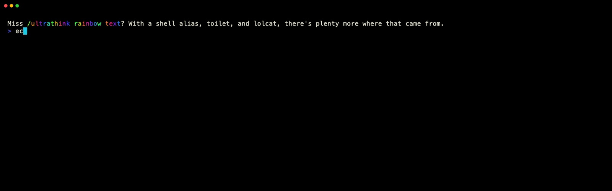

<p align="center">
  
</p>

# claude-yolo

Do you miss /ultrathink rainbow text? are you typing --dangerously-skip-permissions often? 

With a shell alias, `toilet`, and `lolcat`, there's a solution and plenty more where that came from.

## Install

```bash
brew install toilet lolcat   # macOS
sudo apt install toilet lolcat   # Debian/Ubuntu
```

- [toilet](https://github.com/cacalabs/toilet) — ASCII art text
- [lolcat](https://github.com/busyloop/lolcat) — rainbow terminal output
- [Claude Code](https://docs.anthropic.com/en/docs/claude-code)

## The Alias

This is just an example. Sswap fonts, colours, text, whatever. Make it yours.

```bash
alias claude-yolo="echo && toilet -f pagga -F metal 'DANGER ZONE' -w 140 | lolcat -r && echo && claude --dangerously-skip-permissions"
```

Try `toilet --filter list` and `toilet --font list` to see what's available. Pipe anything through `lolcat` for rainbows. Fuck around and find out.

## Make It Stick

Add the alias to your shell config so it's available in every terminal session:

```bash
# zsh (default on macOS)
echo 'alias danger-zone="echo && toilet -f pagga -F metal '\''DANGER ZONE'\'' -w 140 | lolcat -r && echo && claude --dangerously-skip-permissions"' >> ~/.zshrc
source ~/.zshrc

# bash
echo 'alias danger-zone="echo && toilet -f pagga -F metal '\''DANGER ZONE'\'' -w 140 | lolcat -r && echo && claude --dangerously-skip-permissions"' >> ~/.bashrc
source ~/.bashrc
```

Or paste the alias line directly into `~/.zshrc` / `~/.bashrc` with your editor. Either way, `source` the file (or open a new terminal) to start using it.

## Building the Demo

```bash
vhs src/claude-yolo.tape   # requires https://github.com/charmbracelet/vhs
```
